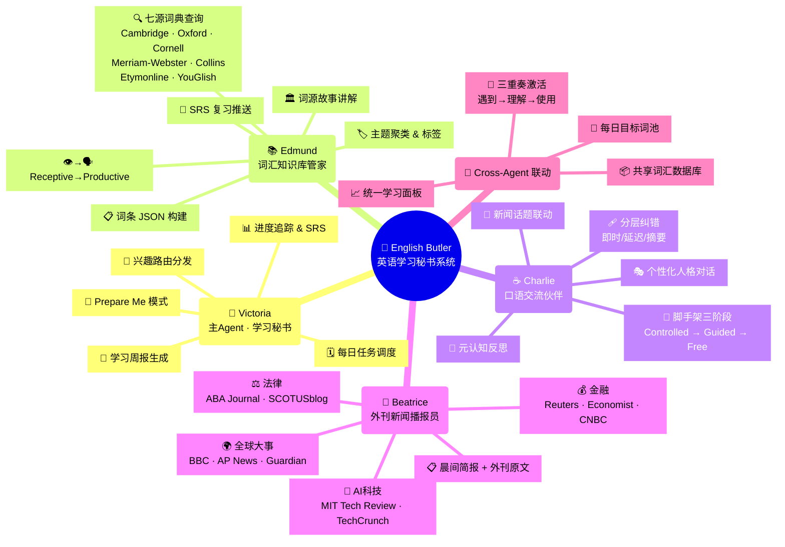
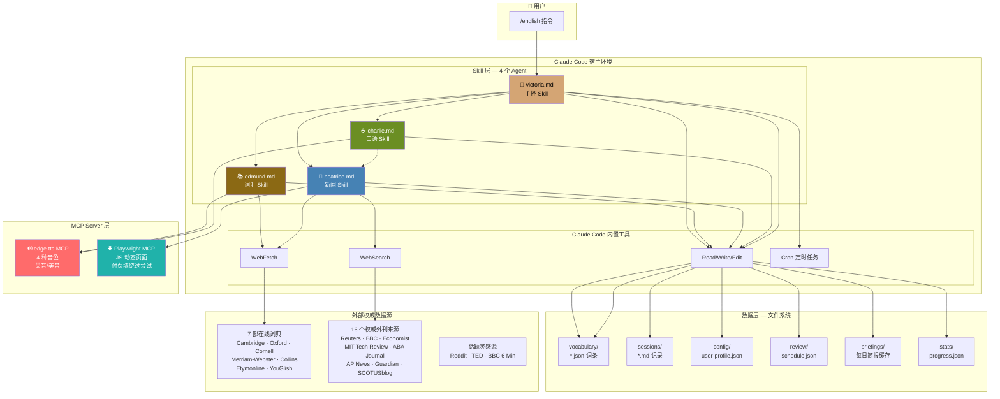

# 英语学习 Agent — 技术方案 2.0

> **目标**: 基于 Claude Code Skill + MCP 机制，实现"1 位秘书 + 3 位专家"的多 Agent 英语学习系统。
>
> **核心升级**: 从单 Skill → 多 Skill 协作 · 从手动查词 → Cross-Agent 词汇三重奏 · 从静态词库 → 新闻驱动的动态学习

***

## 一、产品框架总览（思维导图）



***

## 二、技术架构总览（思维导图）



***

## 三、你需要准备的技术组件

### 3.1 组件清单总表

```
┌──────────────────────────────────────────────────────────────────┐
│                        技术组件全景图                              │
├────────────┬───────────┬──────────┬──────────┬──────────────────┤
│   组件      │   类型     │  数量    │  复杂度   │   依赖            │
├────────────┼───────────┼──────────┼──────────┼──────────────────┤
│ Skill 文件  │ Markdown  │   4 个   │  ⭐⭐⭐   │ 无               │
│ MCP Server │ Python/JS │   2 个   │  ⭐⭐     │ Python 3.11+     │
│ 配置注册    │ JSON      │   2 个   │  ⭐      │ 无               │
│ 数据目录    │ 自动生成   │   1 套   │  ⭐      │ 无               │
└────────────┴───────────┴──────────┴──────────┴──────────────────┘
注：新增「WebSearch + Playwright 浏览器控制」替代自建 RSS MCP，详见下文。
```

### 3.2 四个 Skill 文件

| 文件名                                    | Agent           | 职责          | TTS 音色              |
| -------------------------------------- | --------------- | ----------- | ------------------- |
| `~/.claude/skills/english-tutor.md`    | 🎩 **Victoria** | 主控调度、SRS、周报 | `en-GB-SoniaNeural` |
| `~/.claude/skills/english-edmund.md`   | 📚 **Edmund**   | 词典查询、词条构建   | `en-GB-RyanNeural`  |
| `~/.claude/skills/english-charlie.md`  | ☕ **Charlie**   | 口语对话、纠错     | `en-US-JennyNeural` |
| `~/.claude/skills/english-beatrice.md` | 📰 **Beatrice** | 新闻播报、简报     | `en-GB-LibbyNeural` |

**Skill 间通信方式**: 通过共享文件系统（读写同一 `vocabulary/`、`sessions/` 目录）。Victoria 读取所有数据做决策，子 Agent 各自写入自己的产出。

### 3.3 MCP Server 详情

#### 🔊 edge-tts MCP Server（发音引擎 — v1.0）

| 项目       | 内容                                                                            |
| -------- | ----------------------------------------------------------------------------- |
| **安装**   | `pip install edge-tts`                                                        |
| **费用**   | 免费（微软公开 TTS 服务）                                                               |
| **暴露工具** | `speak(text, accent, speed)`                                                  |
| **支持音色** | 英音: `SoniaNeural`, `RyanNeural`, `LibbyNeural`；美音: `JennyNeural`, `GuyNeural` |
| **代码量**  | \~50 行 Python                                                                 |

```
工具签名:
  speak(text: string, accent: "uk"|"us", voice: string, speed: "slow"|"normal")
  → 输出: 播放 MP3 音频
```

> **未来升级**: v2.0 可叠加 MiniMax MCP Server（41.7K⭐）— 支持情感控制（喜/怒/哀/惊）和语音克隆，让 Agent 表达更丰富的情感层次。安装: `npx -y @smithery/cli install @MiniMax-AI/MiniMax-MCP-JS --client claude`

#### 🌐 Playwright MCP + WebSearch（新闻聚合引擎 — v1.0）

不构建自建 RSS MCP，而是利用 **Claude Code 内置 WebSearch** 搜索 + **Playwright MCP 浏览器控制** 完成新闻聚合。

**核心理念**: Beatrice 的 Skill 中编写工作流：

1. `WebSearch` 发现当日热点文章的 URL
2. `Playwright MCP` 打开浏览器逐个访问这些 URL，截图/抓取正文
3. 浏览器以**有头模式 (headed)** 运行——你打开电脑时能亲眼看到 Claude Code 在访问哪些网站
4. 抓取结果缓存到 `briefings/` 目录

| 项目       | 内容                                                                                     |
| -------- | -------------------------------------------------------------------------------------- |
| **安装**   | `claude mcp add playwright npx @playwright/mcp@latest`                                 |
| **费用**   | 免费                                                                                     |
| **暴露工具** | `browser_navigate`, `browser_snapshot`, `browser_screenshot`, `browser_click` 等 34 个工具 |
| **代码量**  | 0——直接在 Skill 中调用内置工具                                                                   |

```
Beatrice Skill 中调用流程:
  Step 1: WebSearch("today's top AI news 2026-05-16")
          → 获取各源文章 URL 列表
  Step 2: browser_navigate("https://techcrunch.com/...")
          → browser_snapshot → 提取正文
          → 截图保留到 briefings/screenshots/ 供用户查阅
  Step 3: 对每个类别重复 (finance / ai / law / world)
  Step 4: AI 摘要 → Write: briefings/2026-05-16-briefing.md
```

**优势**:

- 🖥️ **可视化**: 浏览器以有头模式运行，你可以看到 Claude Code 正在访问哪些网站
- 🔍 **实时性**: WebSearch 获取的是搜索引擎最新结果，比 RSS 更及时
- 🛠 **零维护**: 无需维护 Python MCP 服务，依赖 Claude Code 内置能力
- 📸 **截图证据**: 每篇文章可截图为证，留存到 `briefings/screenshots/`

**权威外刊来源清单**（Beatrice Skill 中通过 `site:` 限定搜索，确保质量）:

| 类别    | 目标来源                  | 网站                                    |
| ----- | --------------------- | ------------------------------------- |
| 💰 金融 | Reuters Business      | `reuters.com`                         |
| 💰 金融 | BBC Business          | `bbc.com/news/business`               |
| 💰 金融 | The Economist         | `economist.com/finance-and-economics` |
| 💰 金融 | CNBC                  | `cnbc.com`                            |
| 🤖 AI | MIT Technology Review | `technologyreview.com`                |
| 🤖 AI | TechCrunch            | `techcrunch.com`                      |
| 🤖 AI | Ars Technica          | `arstechnica.com`                     |
| 🤖 AI | The Verge             | `theverge.com`                        |
| ⚖️ 法律 | ABA Journal           | `abajournal.com`                      |
| ⚖️ 法律 | SCOTUSblog            | `scotusblog.com`                      |
| ⚖️ 法律 | Reuters Legal         | `reuters.com/legal`                   |
| ⚖️ 法律 | Cornell LII           | `law.cornell.edu`                     |
| 🌍 全球 | BBC World             | `bbc.com/news/world`                  |
| 🌍 全球 | The Guardian          | `theguardian.com/world`               |
| 🌍 全球 | AP News               | `apnews.com`                          |
| 🌍 全球 | Reuters World         | `reuters.com/world`                   |

> **未来升级**: v2.0 可叠加专用新闻 API MCP，但目前 v1.0 优先保证 0 维护成本和可视化体验。

> Playwright MCP 的安装和配置已在上一节中说明，此处不再重复。它是新闻聚合的核心工具，同时也可用于抓取 Bloomberg/FT 等动态页面。

***

## 四、数据层设计

### 4.1 目录结构

```
D:\Node\english-learning\
│
├── config/
│   └── user-profile.json          # 用户画像 & 兴趣向量
│
├── vocabulary/
│   ├── index.json                 # 总索引 {word: {file, status, domain, ...}}
│   ├── meticulous.json            # 一个词一个文件
│   ├── tort.json
│   └── ...
│
├── sessions/
│   ├── 2026-05-15-charlie.md      # Charlie 对话记录
│   ├── 2026-05-15-reflection.md   # 元认知反思
│   └── ...
│
├── briefings/
│   ├── 2026-05-15-briefing.md     # Beatrice 晨间简报
│   ├── 2026-05-15-fulltext.md     # 当日外刊原文（轮换一类）
│   ├── 2026-05-15-sources.md      # 当日抓取来源记录
│   └── screenshots/               # Playwright 浏览器截图存证
│
├── review/
│   └── schedule.json              # SRS 复习日历
│
├── prepare/
│   └── ai-regulation-2026-05-20.json  # Prepare Me 任务清单
│
└── stats/
    └── progress.json              # 学习统计 & 成就
```

### 4.2 核心数据结构

**user-profile.json**:

```json
{
  "name": "HUAWEI",
  "profession": "software engineer",
  "interests": ["AI", "fintech", "intellectual property law"],
  "english_goals": ["read legal documents", "technical presentations", "daily communication"],
  "cefr_levels": {
    "general": "B2",
    "legal": "A2",
    "tech": "C1"
  },
  "preferred_accent": "uk",
  "daily_briefing_time": "07:00",
  "news_categories_priority": ["law", "ai", "finance", "world"],
  "vocabulary_daily_goal": 5
}
```

**vocabulary/index.json**:

```json
{
  "tort": {
    "file": "tort.json",
    "status": "receptive",
    "domain": "law",
    "added_date": "2026-05-15",
    "source": "beatrice-briefing-2026-05-15",
    "activated_by_charlie": 2,
    "last_reviewed": "2026-05-16",
    "srs_stage": 2,
    "srs_next": "2026-05-22"
  }
}
```

**vocabulary/tort.json** (单个词条 — 同技术方案 1.0 结构，新增 `domain` 和 `source` 字段)

***

## 五、核心工作流（技术视角）

### 5.1 新闻→词汇→对话 全链路

```
┌─────────────────────────────────────────────────────────────────┐
│  Step 1: Bea 抓取 (Cron 触发，凌晨预抓取)                         │
│                                                                 │
│  beatrice.md Skill 调用                                         │
│    → RSS MCP: fetch_all_feeds("finance")                        │
│    → RSS MCP: fetch_all_feeds("ai")                             │
│    → RSS MCP: fetch_all_feeds("law")                            │
│    → RSS MCP: fetch_all_feeds("world")                          │
│    → AI 摘要: 每篇 → 100-150 词英文摘要                           │
│    → 关键词提取: 每篇 5-8 个关键词                                 │
│    → Write: briefings/2026-05-15-briefing.md                    │
│    → Write: briefings/2026-05-15-fulltext.md (轮换一类原文)       │
│    → Write: 更新 review/daily-word-pool.json                     │
├─────────────────────────────────────────────────────────────────┤
│  Step 2: 用户触发 (早上打开电脑)                                   │
│                                                                 │
│  User: /briefing                                                │
│    → Victoria 读取 briefings/2026-05-15-briefing.md             │
│    → TTS MCP: Beatrice 音色朗读简报                              │
│    → 展示简报 + Key Vocabulary 列表                              │
├─────────────────────────────────────────────────────────────────┤
│  Step 3: 词汇提取 (用户选择感兴趣的词)                             │
│                                                                 │
│  User: "Edmund, add: tort, liability, negligence"               │
│    → Victoria 调度 → Edmund Skill 启动                           │
│    → WebFetch × 3: Cambridge + Oxford + Cornell LII             │
│    → WebFetch: Etymonline (词源)                                 │
│    → Write: vocabulary/tort.json                                │
│    → TTS MCP: Edmund 音色朗读 3 遍                               │
│    → 更新 vocabulary/index.json                                 │
├─────────────────────────────────────────────────────────────────┤
│  Step 4: 口语激活 (用户触发口语练习)                               │
│                                                                 │
│  User: "/speak stage2"                                          │
│    → Victoria 读取 vocabulary/index.json                        │
│    → 筛选 status=receptive & domain=今日简报主题                  │
│    → Charlie Skill 启动，携带目标词清单                           │
│    → Charlie: "Let's talk about today's legal news..."          │
│    → TTS MCP: Charlie 音色                                      │
│    → 对话中刻意使用目标词                                          │
│    → 分层纠错 (instant recast / delayed summary)                 │
│    → 对话结束: 元认知反思 3 问                                     │
│    → Write: sessions/2026-05-15-charlie.md                      │
│    → 更新 vocabulary/index.json (productive 标记)               │
└─────────────────────────────────────────────────────────────────┘
```

### 5.2 SRS 复习流程

```
Victoria 每日检查 review/schedule.json
  │
  ├── 有到期词?
  │   └── 推送给 Edmund
  │       → Edmund: "Time to review 5 words..."
  │       → TTS 朗读 + 小测验 (造句/填空)
  │       → 答对: srs_stage += 1, 间隔延长
  │       → 答错: srs_stage = 1, 重置间隔
  │       → Write: vocabulary/word.json & index.json
  │
  └── 无到期词?
      └── Victoria: "All caught up! 🎉"
```

***

## 六、Claude Code 配置

### 6.1 settings.json 注册

```json
{
  "mcpServers": {
    "edge-tts": {
      "command": "python",
      "args": ["D:\\Node\\english-learning\\mcp\\edge_tts_server.py"],
      "env": {}
    },
    "rss-aggregator": {
      "command": "python",
      "args": ["D:\\Node\\english-learning\\mcp\\rss_server.py"],
      "env": {}
    }
  },
  "permissions": {
    "allow": [
      "WebFetch",
      "WebSearch",
      "Bash(python *)",
      "Bash(pip *)",
      "Read(D:\\Node\\english-learning\\**)",
      "Write(D:\\Node\\english-learning\\**)",
      "Edit(D:\\Node\\english-learning\\**)"
    ]
  }
}
```

### 6.2 定时任务 (Cron)

通过 Claude Code 的 Cron 机制设置：

| 任务        | Cron         | 描述                                          |
| --------- | ------------ | ------------------------------------------- |
| 凌晨新闻抓取    | `0 5 * * *`  | Beatrice WebSearch + Playwright 抓取新闻，生成简报缓存 |
| 早晨 SRS 检查 | `0 8 * * *`  | Victoria 检查到期复习词汇                           |
| 晚上学习摘要    | `0 22 * * *` | Victoria 生成当日学习摘要                           |

***

## 七、v1.0 → v2.0 关键差异

```
┌──────────────────────┬──────────────────────────────┐
│     技术方案 1.0       │      技术方案 2.0              │
├──────────────────────┼──────────────────────────────┤
│ 1 个 Skill 文件        │ 4 个 Skill 文件 (主+3子)      │
│ 1 个 MCP (TTS)        │ 2 个 MCP (TTS+Playwright) + WebSearch│
│ 两大模块嵌套在一个文件   │ 每个 Agent 独立 Skill，文件通信  │
│ 无新闻功能              │ Beatrice 完整新闻管线 (WebSearch+Playwright) │
│ 无 Cross-Agent 联动    │ 共享词汇库 + 三重奏激活         │
│ 无个性化               │ user-profile.json 兴趣路由     │
│ 无定时任务             │ Cron 预抓取 + SRS 检查          │
│ 添加词汇: 手动输入      │ 添加词汇: 从简报一键提取          │
│ TTS 单一音色           │ 4 种 TTS 音色区分 Agent         │
└──────────────────────┴──────────────────────────────┘
```

***

## 八、MVP 分步交付计划

| 版本       | 交付物                  | 涉及 Skill               | 涉及 MCP                 | 验收标准                          |
| -------- | -------------------- | ---------------------- | ---------------------- | ----------------------------- |
| **v0.1** | Victoria + Edmund 词典 | victoria.md, edmund.md | edge-tts               | 输入词 → 三源释义 + JSON 存储 + TTS 发音 |
| **v0.2** | Charlie 口语           | charlie.md             | edge-tts               | Stage 1-3 对话 + 纠错 + 反思记录      |
| **v0.3** | Beatrice 新闻          | beatrice.md            | playwright + WebSearch | 晨间简报生成 + 外刊原文轮换 + 截图存证        |
| **v0.4** | Cross-Agent 联动       | 全部 4 个                 | 全部                     | 简报→提取词→Charlie 对话使用，闭环        |
| **v0.5** | 个性化 + 定时             | 全部                     | 全部 + Cron              | 兴趣路由 + Prepare Me + 周报        |

***

## 九、MCP Server 关键代码骨架

### edge\_tts\_server.py (核心)

```python
import asyncio
import edge_tts
import tempfile
import subprocess
import json
import sys

VOICES = {
    "victoria": "en-GB-SoniaNeural",   # UK female, warm
    "edmund":    "en-GB-RyanNeural",    # UK male, scholarly
    "charlie":   "en-US-JennyNeural",   # US female, friendly
    "beatrice":  "en-GB-LibbyNeural",   # UK female, broadcast
}

async def speak(text: str, voice: str = "victoria", speed: str = "normal"):
    voice_id = VOICES.get(voice, VOICES["victoria"])
    rate = "-20%" if speed == "slow" else "+0%"
    communicate = edge_tts.Communicate(text, voice_id, rate=rate)
    with tempfile.NamedTemporaryFile(suffix=".mp3", delete=False) as f:
        await communicate.save(f.name)
    subprocess.run(["powershell", "-c", f"Start-Process '{f.name}'"])
    return {"status": "played", "voice": voice}

# MCP stdio protocol — 简写版
# 完整实现见实际代码文件
```

### 字典查询方案说明

v1.0 采用 **WebFetch 联网检索 + 专用词典 MCP 结合** 的方式：

| 词典                       | 方式                 | 说明          |
| ------------------------ | ------------------ | ----------- |
| **Cambridge Dictionary** | Cambridge Dict MCP | 专用 MCP 快速查询 |
| **Oxford Learner's**     | WebFetch           | 爬取释义和例句     |
| **Cornell LII / Wex**    | WebFetch           | 法律术语查询      |
| **Merriam-Webster**      | WebFetch           | 美式英语释义      |
| **Collins Dictionary**   | WebFetch           | 语料库频次标注     |
| **Etymonline**           | WebFetch           | 词源查询        |
| **YouGlish**             | WebFetch           | 真实场景发音视频    |

> **目标**: 将 7 本词典的释义、例句、发音等字段最大程度格式化提取为结构化 JSON 词条。
> **未来升级**: v2.0 可接入 Word Orb MCP（162K 词、47 语言、24 万真实发音）和 Lingua Robot MCP（80 万词条）。

***

## 十、Mind Map 总览（ASCII 版 — 兼容所有终端）

```
                    ┌─────────────────────────────────────────────┐
                    │        🦉 英语学习秘书系统 v2.0              │
                    │        English Butler System                │
                    └────────────────────┬────────────────────────┘
           ┌────────────────────────────┼────────────────────────────┐
           │                            │                            │
    ┌──────▼──────┐            ┌───────▼───────┐           ┌───────▼──────┐
    │  🎩 Victoria │            │  📚 Edmund     │           │  ☕ Charlie   │
    │  主控调度     │◄──────────►│  词汇管家       │◄─────────►│  口语伙伴     │
    │             │  共享词库   │               │  目标词激活  │             │
    │ · 任务分发   │            │ · 7源词典查询  │           │ · 脚手架对话   │
    │ · SRS 追踪  │            │ · 词条JSON构建  │           │ · 分层纠错    │
    │ · 兴趣路由   │            │ · 词源故事     │           │ · 元认知反思   │
    │ · 周报生成   │            │ · 主题聚类     │           │ · 新闻联动    │
    └──────┬──────┘            └───────┬───────┘           └───────┬──────┘
           │                            │                            │
           │         ┌──────────────────┼──────────────────┐         │
           │         │                  │                  │         │
           │   ┌─────▼─────┐    ┌──────▼──────┐    ┌──────▼──────┐  │
           │   │ Cambridge │    │   Oxford    │    │Cornell LII  │  │
           │   │ Dictionary│    │  Learner's  │    │    Wex      │  │
           │   └───────────┘    └─────────────┘    └─────────────┘  │
           │                                                        │
    ┌──────▼──────┐                                                 │
    │ 📰 Beatrice │◄─ WebSearch+Playwright ─► 16 个外刊源              │
    │  新闻播报    │                                                 │
    │             │     💰 金融     🤖 AI      ⚖️ 法律    🌍 全球    │
    │ · 晨间简报   │     Reuters    MIT Tech    ABA Journal  BBC    │
    │ · 外刊原文   │     Economist  TechCrunch  SCOTUSblog   AP News│
    │ · 关键词提取 │     CNBC       ArsTechnica Cornell LII  Guardian│
    └─────────────┘                                                 │
           │                                                        │
    ┌──────▼──────────────────────────────────────────────────────┐ │
    │                     数据层 (文件系统)                        │ │
    │  vocabulary/  │  sessions/  │  briefings/  │  review/       │ │
    │  *.json       │  *.md       │  *.md        │  schedule.json │ │
    └─────────────────────────────────────────────────────────────┘ │
    ┌──────────────────────────────────────────────────────────────┘
    │
    ▼
  ┌──────────────────────────────────────────────┐
  │              MCP 基础设施                      │
  │  🔊 edge-tts MCP  │  🌐 Playwright MCP  │  🔍 WebSearch (内置)  │
  │  4 种 TTS 音色    │  浏览器控制抓取     │  搜索引擎发现新闻      │
  │  英音/美音        │  截图存证           │  限定权威来源         │
  └──────────────────────────────────────────────┘
```

***

*Created: 2026-05-15 | Version: 2.0 | Status: 待确认 | Next: 编写 4 个 Skill 文件 & 搭建 edge-tts MCP Server*
